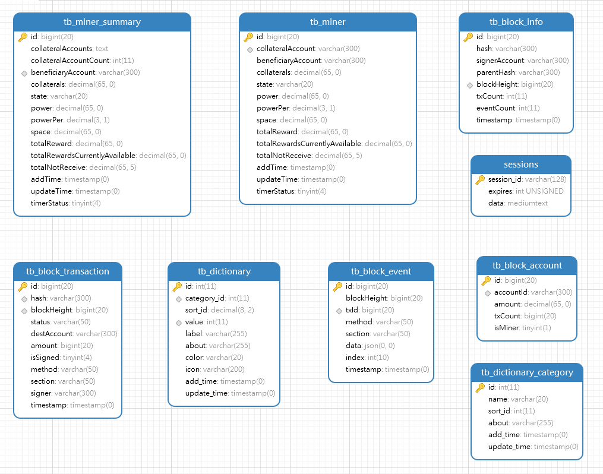

# Data Structure

The database is used to store on-chain data, including block details, transaction information, Event information, Account list, miner list, and transaction status dictionary.

##  Import instruction

Use the Mysql tool to link your database engine, then run the [database-init.sql](database-init.sql) file in the local directory to import a complete database

> Note: The recommended database engine version is mysql-v5.7

After a successful import, a database named 【substats-w3f】 is created automatically.In this database you will see 8 tables, as shown below:

## Data table function

### tb_block_account

On-chain Account List

### tb_block_event

Block event list

### tb_block_info

Block information list, including block height, amount, timestamp, etc

### tb_block_transaction

Transaction information in the block, including the block/transaction Hash/ transaction status/method/signer, etc

### tb_dictionary

Status dictionary list, including key-value dictionary transactional status

### tb_dictionary_category

Status dictionary type list

### tb_miner

Miners list, which keeps the synchronization time from blockchain

### tb_miner_summary

Total of miner's power list