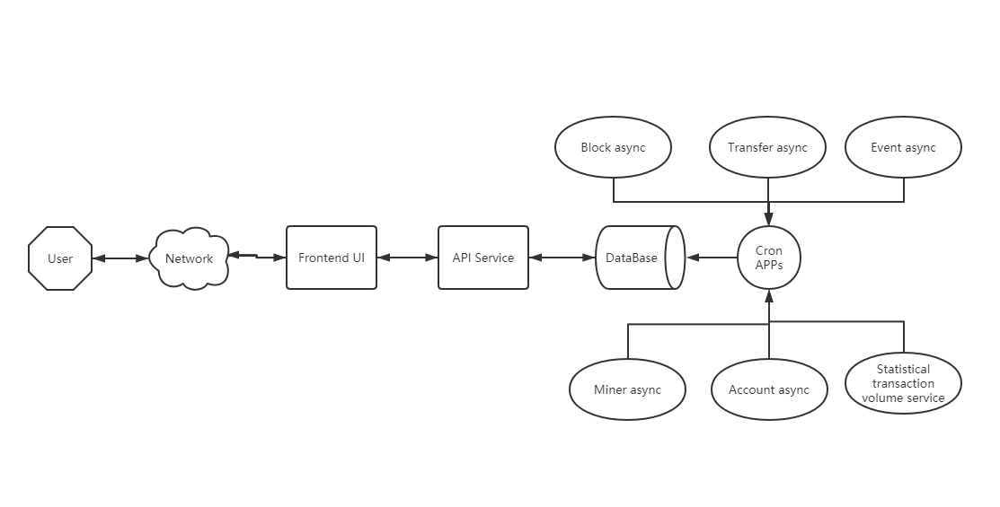

# About the framework

## Main Struction

The system including:

- Scheduled task service
- Back-end API service
- Front-end UI rendering

The scheduled task service can retrieve data from the chain，then processed and stored data in the database.The back-end API service collects data and sends it to the front end.Because the blockchain provides basic API, it cannot fully meet the extension function, so the data needs to be synchronized to the database.For example, if you want to query all the historical transaction records of an Account, or query the status of a transaction through transaction hash, the API of the chain cannot be queried directly.If all the block data is synchronized to the local database, the query can be completed through aggregation.

## Introduction

### 1. Scheduled task service

Scheduled task service is based on Node.Js for the scheduler. The main function is real-time synchronization chain data to the database, using [polkadot. Js] (https://polkadot.js.org/docs/) link RPC interface, through reading and processing the data, it is stored in the database.

Including:
- Block synchronization service
- Transaction record synchronization service
- Events synchronization service
- Miner list synchronization service
- Account list synchronization service
- Transaction volume statistics service

The API service program is located in /app directory

Technology stack:

- Node.js
- Polkadot.js
- Mysql
- SQLITE3
- ORM

### Back-end API service

API service is a web server system developed based on Node.js.The main function is to provide HTTP and Websocket interface for the front end for data query, data processing, block update, including:

- Blockchain bridge
- Database connector
- HTTP web service
- Websocket service

The API service program is located in the root directory

Technology stack:

- Node.js
- Server:Express websocket
- Database:Mysql
- Polkadot
- Jest

### Front-end UI

The main function of the front-end UI system is to read the data of the background API service, render and display.It uses the React.js front-end framework and the Antd UI component library.

The API service program is located in /ui directory

Technology stack:

- React
- Ant-design

